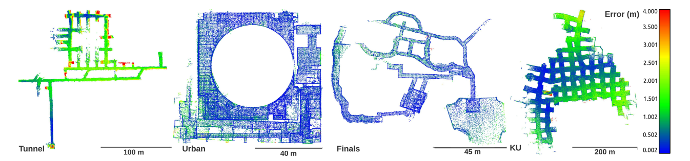

# SLAM Evaluation

A repository containing tools and instructions for evaluating **SLAM localization accuracy** and **3D map quality**.

The repository covers:

- Localization Analysis
- Map Analysis

---

# Requirements

This work was tested on Ubuntu 22.04.

The following tools are required:

- ROS
- EVO
- CloudCompare
- Point Cloud Library (PCL)

---

# Localization Analysis

Localization accuracy is evaluated using **EVO**, which provides trajectory visualization and common odometry evaluation metrics such as:

- Trajectory visualization
- Absolute Pose Error (APE)
- Relative Pose Error (RPE)

---

## Install EVO

Clone and install EVO:

```bash
git clone https://github.com/MichaelGrupp/evo.git
cd ~/evo
pip2 install --editable . --upgrade --no-binary evo
```

Download the `bagmerge.py` file from this repository and place it inside:

```text
~/evo/test/data
```

---

## Merge ROS Bags

Merge the ground-truth and estimated odometry bags:

```bash
cd ~/evo/test/data
python bagmerge.py gt_odometry.bag odometry.bag -o odometry_analysis.bag
```

---

## Trajectory Analysis and Visualization

Visualize the estimated trajectory together with the ground-truth trajectory:

```bash
cd ~/evo/test/data
evo_traj bag odometry_analysis.bag /odom --ref /gt_odom -va --plot --plot_mode=xyz
```

---

## Absolute Pose Error (APE)

Compute the Absolute Pose Error (APE), generate plots, and save the evaluation results:

```bash
cd ~/evo/test/data
mkdir results
evo_ape bag odometry_analysis.bag /gt_odom /odom -va --plot --plot_mode=xyz --save_results results/odometry_analysis.zip
```

Trajectory correspondence is established using timestamps.

The timestamps do not need to be identical, but should ideally be synchronized and lie within the same time interval.

If necessary, adjust the synchronization using:

```text
--t_max_diff
--t_offset
```

For example:

```text
--t_max_diff T_MAX_DIFF   maximum timestamp difference for data association

--t_offset T_OFFSET       constant timestamp offset for data association
```

If trajectory alignment should depend only on the geometric trajectory shape, use a trajectory format without timestamps (e.g., KITTI format). In that case, both trajectories must contain exactly the same number of corresponding poses.

---

## Relative Pose Error (RPE)

Compute the Relative Pose Error (RPE), generate plots, and save the evaluation results:

```bash
cd ~/evo/test/data
mkdir results
evo_rpe bag odometry_analysis.bag /gt_odom /odom -va --plot --plot_mode=xyz --save_results results/odometry_analysis.zip
```

To align the trajectory origins during RPE evaluation, add:

```text
--align_origin
```

---

## Post-processing Results

Generate summary plots and export evaluation statistics:

```bash
cd ~/evo/test/data
mkdir results
evo_res results/odometry_analysis.zip -p --save_table results/table.csv
```

---

## ROS Bag to Text Conversion (Optional)

Convert the odometry topic into a text file:

```bash
rostopic echo -b odometry_analysis.bag -p /odom > odom.txt
```

---

# Localization Evaluation Metrics

Localization accuracy measures how close the estimated robot trajectory is to the ground-truth trajectory.

## Pose Representation

A robot pose at time `i` is represented as:

```text
T_i = [R_i | t_i]
```

where:

- `R_i` is the 3×3 rotation matrix.
- `t_i` is the 3×1 translation vector.
- `T_i` represents the robot pose in the world frame.

Given:

- Ground-truth trajectory: `T_gt,i`
- Estimated trajectory: `T_est,i`

the following localization metrics are computed.

---

## Absolute Pose Error (APE)

Absolute Pose Error measures the global difference between the estimated trajectory and the ground-truth trajectory.

For each timestamp `i`, the pose error is:

```text
E_i = T_gt,i^-1 * T_est,i
```

The translational APE is computed as:

```text
APE_i = || trans(E_i) ||
```

where:

- `E_i` is the relative pose error between ground truth and estimate.
- `trans(E_i)` extracts the translation component.
- `|| . ||` is the Euclidean norm.

APE measures how far the estimated robot position is from the ground-truth position at each timestamp.

Lower APE indicates better global localization accuracy.

APE is useful for evaluating:

- global trajectory drift
- accumulated SLAM error
- final map-level localization consistency

---

## Relative Pose Error (RPE)

Relative Pose Error measures the local motion error between two poses separated by a fixed time interval or frame interval.

For a time interval `Δ`, the relative motion error is:

```text
E_i = (T_gt,i^-1 * T_gt,i+Δ)^-1 * (T_est,i^-1 * T_est,i+Δ)
```

The translational RPE is:

```text
RPE_i = || trans(E_i) ||
```

RPE evaluates how accurately the system estimates motion between nearby poses.

Lower RPE indicates better local motion consistency.

RPE is useful for evaluating:

- odometry drift
- short-term motion estimation error
- frame-to-frame tracking quality

---

## APE vs RPE

APE and RPE measure different types of SLAM error.

APE measures global trajectory error.

RPE measures local motion error.

In practice:

- A system can have low RPE but high APE if small local errors accumulate over time.
- A system can have good short-term odometry but poor long-term global consistency.
- Loop closure usually improves APE more than RPE.

---

## Trajectory Alignment

Before computing APE or RPE, trajectories may need to be aligned.

EVO supports different alignment options.

Common alignment modes include:

- no alignment
- origin alignment
- SE(3) alignment
- Sim(3) alignment

Origin alignment aligns only the first pose of the estimated trajectory with the first pose of the ground-truth trajectory.

SE(3) alignment estimates a rigid transformation between the two trajectories.

Sim(3) alignment estimates rotation, translation, and scale.

Sim(3) alignment is useful for monocular SLAM systems where scale may be unknown.

---

## Translation Error

Translation error measures the Euclidean distance between estimated and ground-truth positions.

```text
translation_error_i = || t_est,i - t_gt,i ||
```

where:

- `t_est,i` is the estimated translation at timestamp `i`.
- `t_gt,i` is the ground-truth translation at timestamp `i`.

The result is usually reported in meters.

Lower translation error indicates better position accuracy.

---

## Rotation Error

Rotation error measures the angular difference between estimated and ground-truth orientations.

First, compute the relative rotation:

```text
R_err = R_est * R_gt^T
```

Then compute the geodesic rotation error:

```text
rotation_error = acos((trace(R_err) - 1) / 2)
```

The result is usually reported in degrees.

Lower rotation error indicates better orientation accuracy.

---

## RMSE

Root Mean Squared Error summarizes the overall trajectory error.

For translation errors `e_i`, RMSE is:

```text
RMSE = sqrt((1 / N) * Σ e_i^2)
```

where:

- `N` is the number of matched poses.
- `e_i` is the error at timestamp `i`.

RMSE penalizes large errors more strongly than the mean error.

Lower RMSE indicates better overall performance.

---

## Mean Error

Mean error is the average error over all matched poses.

```text
mean_error = (1 / N) * Σ e_i
```

Mean error gives the average localization error.

Lower mean error indicates better average performance.

---

## Median Error

Median error is the middle value of all pose errors after sorting.

Median error is less sensitive to large outliers than RMSE.

It is useful when a trajectory contains occasional tracking failures or jumps.

---

## Standard Deviation

Standard deviation measures how much the pose error varies over the trajectory.

A low standard deviation means the error is consistent.

A high standard deviation means the error changes significantly over time.

---

# Map Analysis

<div align="center">
  
</div>

Map quality is evaluated using **CloudCompare** together with the **Point Cloud Library (PCL)**.

The workflow consists of:

- Converting point clouds
- Computing point-to-point errors
- Visualizing reconstruction quality

---

## Install CloudCompare

Install CloudCompare using:

```bash
sudo snap install cloudcompare
```

---

## Install PCL Tools

Install the Point Cloud Library utilities:

```bash
sudo apt install pcl-tools
```

---

## Convert PCD Files to PLY

Navigate to the directory containing the generated map and the ground-truth map.

Convert both point clouds to PLY format:

```bash
pcl_pcd2ply map.pcd map.ply
pcl_pcd2ply gt_map.pcd gt_map.ply
```

---

## Open CloudCompare

Launch CloudCompare:

```bash
cloudcompare.CloudCompare
```

Import both PLY files by dragging and dropping them into the application.

Select both point clouds (hold **Ctrl**) to activate the distance comparison tool.

---

## Compute Point Cloud Error

After installing `pcl-tools`, additional utilities are available in the PCL tools package.

Compute nearest-neighbor point cloud error using:

```bash
pcl_compute_cloud_error filename.pcd error_pc_out.pcd -correspondence nn > error.txt
```

where:

- `filename.pcd` — input point cloud
- `error_pc_out.pcd` — output point cloud colored by error
- `-correspondence nn` — nearest-neighbor correspondence
- `error.txt` — output text file containing error statistics

---

## Downsample Point Clouds (Optional)

To reduce point cloud density before evaluation, apply a voxel grid filter:

```bash
pcl_voxel_grid output.pcd input.pcd -leaf 0.0025
```

---

## Compute Cloud-to-Cloud Distance

Follow the CloudCompare documentation to compute point-to-point distances:

https://www.cloudcompare.org/doc/wiki/index.php?title=Cloud-to-Cloud_Distance

When computing distances:

- Compared cloud: `map.ply`
- Reference cloud: `gt_map.ply`

Import both point clouds and click **Compute**.

---

## Visualize Error

After the distance computation:

- The bottom console reports:
  - Mean Distance
  - Standard Deviation
- Select `map.ply` from the **DB Tree**.
- Enable the color bar from **Properties**.
- Change the background:
  - **Display → Display Settings → Colors and Materials → Colors → Background**
- Hide `gt_map.ply` in the **DB Tree**.
- Hide the center "+" marker using:
  - **Display → Toggle Viewer Based Perspective**

# Map Evaluation Metrics

Map evaluation compares the reconstructed point cloud map against a reference ground-truth map.

Given:

- Estimated map point cloud: `P_est`
- Ground-truth map point cloud: `P_gt`

map error is computed using point-to-point distances.

---

## Point-to-Point Distance

For each point `p_i` in the estimated map, the nearest point in the ground-truth map is found.

```text
d_i = min || p_i - q_j ||
```

where:

- `p_i` is a point in the estimated map.
- `q_j` is a point in the ground-truth map.
- `d_i` is the nearest-neighbor distance.

Lower point-to-point distance indicates better map reconstruction accuracy.

---

## Cloud-to-Cloud Distance

Cloud-to-cloud distance computes nearest-neighbor distances between two point clouds.

In this repository:

- compared cloud: `map.ply`
- reference cloud: `gt_map.ply`

The distance is computed from the estimated map to the ground-truth map.

This means each point in `map.ply` is compared against the nearest point in `gt_map.ply`.

---

## Mean Map Error

Mean map error is the average point-to-point distance over all compared points.

```text
mean_map_error = (1 / N) * Σ d_i
```

where:

- `N` is the number of points in the estimated map.
- `d_i` is the nearest-neighbor distance for point `i`.

Lower mean map error indicates a more accurate reconstructed map.

---

## Standard Deviation of Map Error

The standard deviation of map error measures how much the point-to-point distances vary.

Low standard deviation means the map error is spatially consistent.

High standard deviation may indicate:

- local map distortion
- drift
- duplicated structures
- poor alignment
- dynamic objects
- missing surfaces

---

## Nearest-Neighbor Correspondence

Nearest-neighbor correspondence assigns each point in the estimated map to the closest point in the ground-truth map.

This is used by:

```bash
pcl_compute_cloud_error filename.pcd error_pc_out.pcd -correspondence nn > error.txt
```

The `-correspondence nn` option means nearest-neighbor matching is used.

This is useful when the estimated and ground-truth maps do not have the same number of points.

---

## Voxel Grid Downsampling

Voxel grid downsampling reduces the number of points in a point cloud.

The command:

```bash
pcl_voxel_grid output.pcd input.pcd -leaf 0.0025
```

uses a voxel size of:

```text
0.0025 m
```

or:

```text
2.5 mm
```

Downsampling is useful for:

- reducing memory usage
- speeding up cloud comparison
- making point density more uniform

However, too much downsampling can remove important geometric details.

---

## Interpreting SLAM Evaluation Results

For localization:

- lower APE means better global accuracy
- lower RPE means better local motion accuracy
- lower RMSE means better overall trajectory accuracy
- lower rotation error means better orientation estimation
- lower translation error means better position estimation

For map evaluation:

- lower mean cloud-to-cloud distance means better map accuracy
- lower standard deviation means more consistent reconstruction
- large local errors may indicate drift, misalignment, or reconstruction artifacts

---
